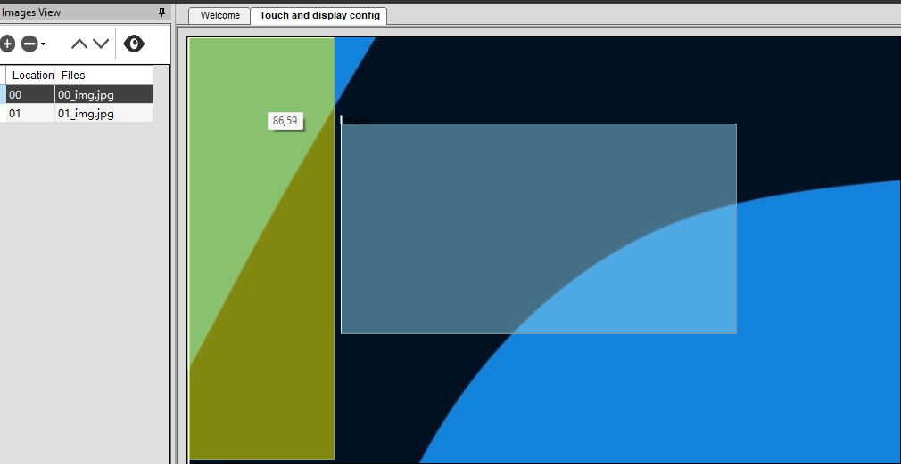

## Attendance Management and Display System

**Project Overview**

This project tackles common challenges faced in educational settings by providing a comprehensive solution to streamline and enhance classroom management. It consists of a website and a display system that work together to improve the efficiency and security of student attendance tracking while providing essential session information.

* **Website:** Automates attendance recording, saving time for both students and instructors while ensuring accurate and secure data.
* **Display System:** Shows real-time information about ongoing sessions, providing students with quick access to details.

By integrating advanced programming, networking, and display technologies, this project offers a cohesive solution for modern educational institutions. It aims to simplify administrative tasks, improve security, and enhance the accessibility of classroom information for students.

## Project Branches

**1. Web Application** (Main Branch)

* Controls student attendance and manages data for the current session in the room.

**2. Screens for Display**

* Utilizes Dwin screens controlled via a microcontroller to display session data, including professor information and additional details.

**3. Network Management**

* Establishes a wide-ranging network through access points to allow students and screens to connect to the main website.

## Web Application

This Django application offers a robust solution for managing attendance seamlessly.

* **Data Structure:** Includes entities like students, courses, lectures, labs, groups, and classes.
* **Session Management:** Allows for creating, editing, and deleting sessions.
* **Attendance Tracking:** Enables students to submit attendance requests via the website.

**Additional Features:**

* Automated session closure ensures attendance cannot be submitted after a session has begun (prevents manipulation).
* Automatic generation of attendance reports in Excel format and email delivery to instructors streamlines data analysis and record-keeping.

## Technologies Used

* Django (Web Framework)
* JavaScript
* Bootstrap (Front-end Framework)
* ipware (IP Geolocation)
* threading (Multitasking)
* openpyxl (Excel File Generation)
* EmailMessage (Email Sending)

**Web Application Features**

* **Authentication:** Admin and user roles with distinct functionalities.

    * **Admin can:**
        * Create events (lectures, labs) by selecting the course, lecturer, date, and student group.
        * Edit or delete events as needed.
        * Prepare events for student attendance.
   
  

    * **User can:**
        * Update their personal data (password, device).
        * View the daily lecture schedule for efficient planning.
        * Scan QR codes to attend lectures conveniently.
        
           

* **Device Detection:** Utilizes ipware to identify:
    * Device type and brand for potential security checks.
    * Network IP to verify if the student is physically present in the lecture hall (prevents unauthorized attendance).
    * Device criteria against the database to ensure it belongs to the registered student (prevents proxy attendance).
    
  

* **API for Display Screens:** Delivers session data in JSON format, including:
    * Case (1 - Professor with image, 2 - Professor without image, 3 - No session)
    * Students (Group information)
    * Session Type (Lecture, Lab)
    * Department Name
    * College Name
    * Professor Name
    * Subject Name (Course)
    * Time
    * pic_id (Professor image ID in screen memory)

* **Image Management for Screens:**
    * A function creates and stores professor images in a designated folder for display.
    * Main images include homepage, loading page, empty image for professors without a system image, and an info page for messages (empty room, errors).
    * A script creates a zip file of all images for easy transfer to the screens.

  

## Screens for Display

This section presents session details on Dwin 7-inch screens.

**Hardware**

* ESP32 Microcontroller
* DWIN 7-inch screen model "DMG80480T70_15WTR"
* Custom PCB designed for the circuit
* UART communication protocol

**Software**

* DGUS software by DWIN Technology
    * Allows for page creation, text display, touch interaction, audio, and more.
    * Focuses on page and text display initially for clear information presentation.
    * Each text has a unique VP address for memory access and string display.

  

* Microcontroller Software
    * ESP32-WROOM-32 with integrated WIFI for network connectivity.
    * Connects to the network and sends GET requests to the web application's API to retrieve data.
    * Receives JSON data of the current session in the room (or upcoming session if none is active).
    * Processes the data

To Finally produce This:

  

**Additional Resources**

* Watch a video demonstration of the Web app in action: [Click Here](https://youtu.be/6o3CpS-8aC4).

* Watch a video of the screens: [Click Here](https://youtu.be/HJsce49xAmY).

**THANKS!**
